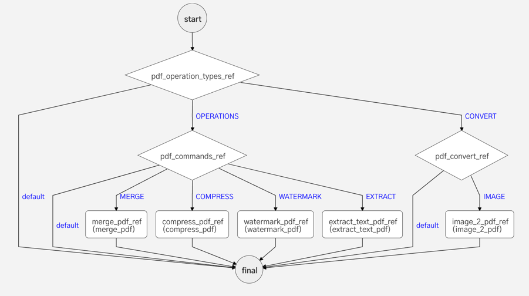

# Workflow for PDF Operations using Netflix Conductor

### Convert, Merge, Compress, Extract, Watermark Documents Automatically with Netflix Conductor

When sending documents over the internet, the most preferred type is PDF. So there is a growing demand for operations over PDF. Although there are plenty of online tools that does PDF operations. When it comes to integrating these operations as part of 
a flow it requires a lot of effort in finding the right libraries and scaling the operations. 

Thus, this workflow when integrated into any system, makes the system capable of doing PDF operations on the go without worrying about scaling or development. This workflow currently uses base64 strings as input and output so there is no need for any external storage systems or CDN's
for storing files. There are a lot of practical applications for this workflow which includes but not limited to :

1. Enable authors to embed user specific watermarks to their PDF files uploaded to an Ebook Sharing Site.
2. Enable conversion of any number of images into a single PDF document for easy transfer.

## Features

1. Merge PDF: Merge any number of PDF files. 

Input

```json
{
  "type": "OPERATIONS",
  "operation": {
    "command": "MERGE",
    "input_files": [
      "base64_encoded_file_1",
      "base64_encoded_file_2"
    ]
  }
}
```

Output

```json
{
  "output_file": "base64_encoded_output_file",
  "file_name": "Merged.pdf"
}
```

2. Compress PDF: Compress PDF files (supports images).

Input

```json
{
  "type": "OPERATIONS",
  "operation": {
    "command": "COMPRESS",
    "input_files": [
      "base64_encoded_file"
    ]
  }
}
```

Output

```json
{
  "output_file": "base64_encoded_output_file",
  "file_name": "Compressed.pdf"
}
```

3. Extract PDF: Extract text from PDF files.

Input

```json
{
  "type": "OPERATIONS",
  "operation": {
    "command": "EXTRACT",
    "input_files": [
      "base64_encoded_file"
    ]
  }
}
```

Output

```json
{
  "output_file": "base64_encoded_output_file",
  "file_name": "Extracted.pdf"
}
```

4. Watermark PDF: Extract text from PDF files.


Input

```json
{
  "type": "OPERATIONS",
  "operation": {
    "command": "WATERMARK",
    "watermark_type": "TEXT", // This can be either TEXT or IMAGE.
    "watermark_data": "I am a watermark", // If type is TEXT, provide the text to be added as a watermark. For Image add the base64_encoded string of image.
    "input_files": [
      "base64_encoded_file"
    ]
  }
}
```

Output

```json
{
  "output_file": "base64_encoded_output_file",
  "file_name": "Watermarked.pdf"
}
```

5. Convert Image(s) to PDF: Convert image(s) to a single PDF file.

Input

```json
{
  "type": "CONVERT",
  "operation": {
    "command": "IMAGE",
    "input_files": [
      "base64_encoded_image_file_1",
      "base64_encoded_image_file_2",
      "base64_encoded_image_file_3",
      .....
    ]
  }
}
```

Output

```json
{
  "output_file": "base64_encoded_output_file",
  "file_name": "Watermarked.pdf"
}
```

## Flow Diagram

